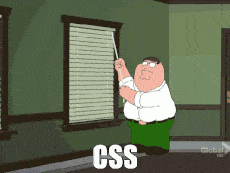
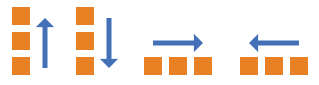
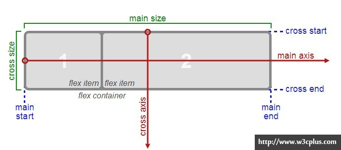
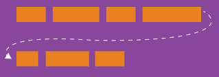
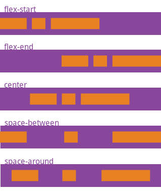
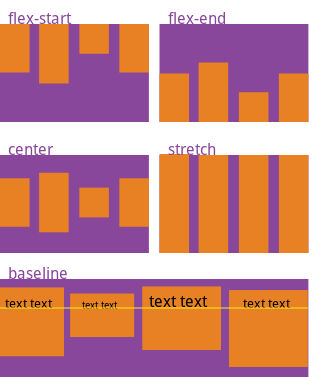
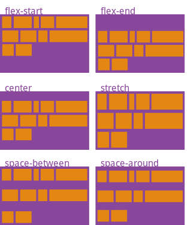
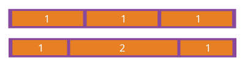
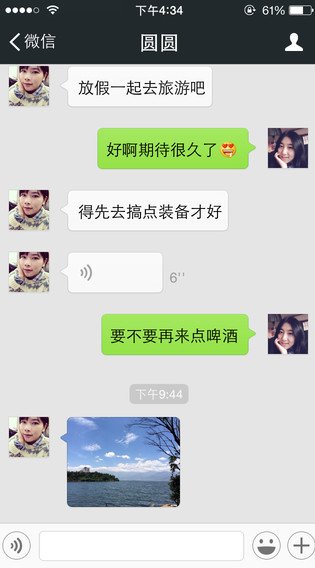

# 弹性布局

## 弹性布局是

* 一套全新的布局思路
* 一组CSS属性

## 原来的布局方案有什么问题？

传统的布局方案是这样的：

* HTML默认是流式排版：把元素从左向右，从上到下依次排开。
* 配合CSS, 使用浮动、绝对定位和相对定位满足非流式的布局需求

传统布局方案的问题是： **太他妈难调了！**



## 弹性布局的优点

* 全新的布局思路，更符合正常人的思维，能够自然的描述布局，例如：
  + a. 这个对话框里的内容分为左中右三块，左边为固定的200像素宽，剩下的部分按1:2划分。
  + b. 这个编辑器要撑满浏览器，随着浏览器大小变化，分为上下两块，上边是固定50像素高的工具条，下边是一个编辑框。

* 空间计算能力强，可伸缩，具有弹性。

## 如何简单描述一个弹性容器

##### 容器的基本定义

* 这个元素作为一个容器，其内部的元素使用弹性布局。
  + `display: flex;`

* 主轴方向：容器内部的元素按照水平（从左到右 或 从右到左）或垂直方向（从上到下 或 从下到上）排列。
  + 
  + `flex-direction: row | row-reverse | column | column-reverse`
  + 容器主轴的头和尾
  + 容器侧轴的头和尾
  + 

##### 容器内部的固定大小元素的排列规则

* 如果容器在主轴排满了，是否可以换行。
  + 
  + `flex-wrap: nowrap | wrap | wrap-reverse`

* 主轴对齐：容器内部的元素在主轴方向上的对齐方式是怎样的。（头对齐、尾对齐、居中、散列、顶头散列）
  + `justify-content: flex-start | flex-end | center | space-between | space-around;`
  + 

* 侧轴对齐：
  + `align-items: flex-start | flex-end | center | baseline | stretch;`
  + 

* 如果有换行，测轴方向剩余空间的使用规则
  + `align-content: flex-start | flex-end | center | space-between | space-around | stretch;`
  + 

##### 容器内部的弹性元素的尺寸计算规则

* 元素将如何增大自己的尺寸
  + `flex-grow: <number>; /* default 0 */`
  + 

* 元素将如何压缩自己的尺寸
  + `flex-shrink: <number>; /* default 0 */`

* 元素的初始尺寸
  + `flex-basis: <length> | auto; /* default auto */`

* 组合：
  + `flex: none | [ <'flex-grow'> <'flex-shrink'>? || <'flex-basis'> ]`

## 参考文章

* 英文 https://css-tricks.com/snippets/css/a-guide-to-flexbox/
* 中文 http://www.w3cplus.com/css3/a-guide-to-flexbox.html

## 实际例子



[codepen的代码地址](http://codepen.io/anon/pen/gPVjmg)

##### 整体结构

* 整体分为上中下三块

```html
<div class="main">
  <div class="top">顶部导航</div>
  <div class="cet">聊天内容</div>
  <div class="bot">底部输入框</div>
</div>
```

```css
*{font-size:14px; color:white; }
html, body{height:100%; margin: 0px; }

.main{height:100%; display:flex; flex-direction: column; background:lightgray; }
.top{height:30px; background:black;padding: 5px; }
.bot{height:50px; background:black;padding: 5px; }
.cet{flex:1;font-size:12px; color:black; padding: 5px; }
```

* 顶部导航部分分为左中右三块（回退、人名、菜单），因此内容变为

```html
<div class="main">
  <div class="top">
    <div class="lef">&lt;微信</div>
    <div class="cet">圆圆</div>
    <div class="rig">人头</div>
  </div>
  <div class="cet">聊天内容</div>
  <div class="bot">底部输入框</div>
</div>
```

```css
*{font-size:14px; color:white; }
html, body{height:100%; margin: 0px; }

.main{height:100%; display:flex; flex-direction: column; background:lightgray; }
.top{height:30px; background:black;padding: 5px; display:flex;flex-direction: row;}
.top .lef{width:50px; margin:5px;}
.top .rig{width:50px; margin:5px;}
.top .cet{flex:1; font-size:18px; color:white;text-align:center;}
.bot{height:50px; background:black;padding: 5px; }
.cet{flex:1;font-size:12px; color:black; padding: 5px; }
```

* 底部输入框也是左中右三部分（语音输入按钮、文字输入框、两个按钮），因此内容变为：

```html
<div class="main">
  <div class="top">
    <div class="lef">&lt;微信</div>
    <div class="cet">圆圆</div>
    <div class="rig">人头</div>
  </div>
  <div class="cet">聊天内容</div>
  <div class="bot">
    <button class="lef">0</button>
    <input class="cet" type="text">
    <button class="rig">1</button>
    <button class="rig">2</button>
  </div>
</div>
```

```css
*{font-size:14px; color:white; }
html, body{height:100%; margin: 0px; }

.main{height:100%; display:flex; flex-direction: column; background:#999; }

.top{height:30px; background:black;padding: 5px; display:flex;flex-direction: row;}
.top .lef{width:50px; margin:5px;}
.top .rig{width:50px; margin:5px;}
.top .cet{flex:1; font-size:18px; color:white;text-align:center;}

.bot{height:30px; background:lightgray; padding: 5px; display:flex;flex-direction: row;}
.bot button{width:25px; height:25px; margin:5px;border-color:black; border-radius:10px;color:black;}
.bot .cet{flex:1; font-size:18px; color:white;text-align:center;border-radius:5px;}

.cet{flex:1;font-size:12px; color:black; padding: 5px; }
```